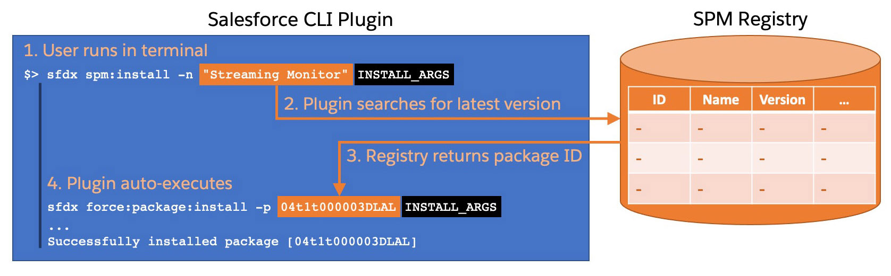

[](https://www.npmjs.com/package/spm-plugin)

# Salesforce Package Manager (SPM) Plugin

**⚠️ The registry service was discontinued on Nov 1st 2022 ⚠️**

A Salesforce CLI plugin for interacting with the unofficial [Salesforce Package Manager (SPM) registry](https://spm-registry.herokuapp.com/).

In short: this plugin provides a user-friendly way to install Salesforce packages using a package name instead fo the package version ID.<br/>
Moving from `sfdx force:package:install -p 04t1t000003DLAL`<br/>
...to `sfdx spm:install -n 'Streaming Monitor'`.

## Plugin installation

Install the plugin by running this command in a terminal:

```sh
sfdx plugins:install spm-plugin
```

## Overview

As the saying goes "a picture is worth a thousand words" so here's how the Salesforce Package Manager (SPM) works:

### Installing a package



### Publishing a package

> **Note**
> You do not need to own a package in order to publish it. You just need to know the package version ID.


## Setting up a Private Registry

You can set up a private registry by following these instructions:

1. Install the [SPM Registry](https://github.com/pozil/spm-registry) server
1. Use the SPM plugin with the `-z` or `--registryurl` flag:
    ```
    sfdx spm:install -n 'Streaming Monitor' --registryurl http://localhost:3002/
    ```


## Command Reference

This doc section is auto generated.

<!-- toc -->
* [Salesforce Package Manager (SPM) Plugin](#salesforce-package-manager-spm-plugin)
<!-- tocstop -->
<!-- usage -->
```sh-session
$ npm install -g spm-plugin
$ sfdx COMMAND
running command...
$ sfdx (-v|--version|version)
spm-plugin/1.0.8 darwin-x64 node-v14.17.3
$ sfdx --help [COMMAND]
USAGE
  $ sfdx COMMAND
...
```
<!-- usagestop -->
<!-- commands -->
* [`sfdx spm:install -n <string> [-v <string>] [-i] [-z <url>] [-a all|package] [-b <minutes>] [-k <string>] [-r] [-s AllUsers|AdminsOnly] [-t DeprecateOnly|Mixed|Delete] [-w <minutes>] [-u <string>] [--apiversion <string>] [--json] [--loglevel trace|debug|info|warn|error|fatal|TRACE|DEBUG|INFO|WARN|ERROR|FATAL]`](#sfdx-spminstall--n-string--v-string--i--z-url--a-allpackage--b-minutes--k-string--r--s-allusersadminsonly--t-deprecateonlymixeddelete--w-minutes--u-string---apiversion-string---json---loglevel-tracedebuginfowarnerrorfataltracedebuginfowarnerrorfatal)
* [`sfdx spm:publish -v <string> [-z <url>] [--json] [--loglevel trace|debug|info|warn|error|fatal|TRACE|DEBUG|INFO|WARN|ERROR|FATAL]`](#sfdx-spmpublish--v-string--z-url---json---loglevel-tracedebuginfowarnerrorfataltracedebuginfowarnerrorfatal)

## `sfdx spm:install -n <string> [-v <string>] [-i] [-z <url>] [-a all|package] [-b <minutes>] [-k <string>] [-r] [-s AllUsers|AdminsOnly] [-t DeprecateOnly|Mixed|Delete] [-w <minutes>] [-u <string>] [--apiversion <string>] [--json] [--loglevel trace|debug|info|warn|error|fatal|TRACE|DEBUG|INFO|WARN|ERROR|FATAL]`

installs a package from the SPM registry

```
USAGE
  $ sfdx spm:install -n <string> [-v <string>] [-i] [-z <url>] [-a all|package] [-b <minutes>] [-k <string>] [-r] [-s 
  AllUsers|AdminsOnly] [-t DeprecateOnly|Mixed|Delete] [-w <minutes>] [-u <string>] [--apiversion <string>] [--json] 
  [--loglevel trace|debug|info|warn|error|fatal|TRACE|DEBUG|INFO|WARN|ERROR|FATAL]

OPTIONS
  -a, --apexcompile=(all|package)
      compile all Apex in the org and package, or only Apex in the package; unlocked packages only

  -b, --publishwait=publishwait
      number of minutes to wait for subscriber package version ID to become available in the target org

  -i, --includebeta
      whether beta versions are included when searching for the latest versions

  -k, --installationkey=installationkey
      installation key for key-protected package

  -n, --name=name
      (required) name of the package as specified in the SPM registry

  -r, --noprompt
      do not prompt for confirmation

  -s, --securitytype=(AllUsers|AdminsOnly)
      [default: AdminsOnly] security access type for the installed package (deprecation notice: The default --securitytype
      value will change from AllUsers to AdminsOnly in v47.0 or later.)

  -t, --upgradetype=(DeprecateOnly|Mixed|Delete)
      [default: Mixed] the upgrade type for the package installation; available only for unlocked packages

  -u, --targetusername=targetusername
      username or alias for the target org; overrides default target org

  -v, --version=version
      [default: latest] version of the package as specified in the SPM registry

  -w, --wait=wait
      number of minutes to wait for installation status

  -z, --registryurl=registryurl
      the URL for a private SPM registry. If not specified, the public SPM registry is used.

  --apiversion=apiversion
      override the api version used for api requests made by this command

  --json
      format output as json

  --loglevel=(trace|debug|info|warn|error|fatal|TRACE|DEBUG|INFO|WARN|ERROR|FATAL)
      [default: warn] logging level for this command invocation

DESCRIPTION
  This commands locates the package version ID thanks to the SPM registry and uses 'force:package:install' to install 
  it.
  All 'force:package:install' options are supported appart from '-p, --package'.
  The following flags are specific to this command:
       -n, --name=name
       -v, --version=version
       -i, --includebeta
       -z, --registryurl

EXAMPLES
  $ sfdx spm:install -n 'Streaming Monitor' -u myOrg
      Querying SPM registry... done
      Found package 'Streaming Monitor@3.2' with ID 04t1t000003DLAL

      sfdx force:package:install --package 04t1t000003DLAL --targetusername myOrg --loglevel warn

      PackageInstallRequest is currently InProgress. You can continue to query the status using
      sfdx force:package:install:report -i 0Hf3F0000005lG0SAI -u test-cus7edbxwwy1@example.com


  $ sfdx spm:install -n Quiz -i -u quizOrg -w 10
      Querying SPM registry... done
      Found package 'Quiz@2.6' with ID 04t5p000001BloG

      sfdx force:package:install --package 04t5p000001BloG --targetusername quizOrg --wait 10 --loglevel warn

      This package might send or receive data from these third-party websites:

      https://chart.googleapis.com

      Grant access (y/n)?: y

      Waiting for the package install request to complete. Status = IN_PROGRESS
      Waiting for the package install request to complete. Status = IN_PROGRESS
      Successfully installed package [04t5p000001BloG]
```

_See code: [src/commands/spm/install.ts](https://github.com/pozil/spm-plugin/blob/v1.0.8/src/commands/spm/install.ts)_

## `sfdx spm:publish -v <string> [-z <url>] [--json] [--loglevel trace|debug|info|warn|error|fatal|TRACE|DEBUG|INFO|WARN|ERROR|FATAL]`

publishes a package to the SPM registry

```
USAGE
  $ sfdx spm:publish -v <string> [-z <url>] [--json] [--loglevel 
  trace|debug|info|warn|error|fatal|TRACE|DEBUG|INFO|WARN|ERROR|FATAL]

OPTIONS
  -v, --version=version                                                             (required) Salesforce package
                                                                                    version ID. A 15 or 18 character
                                                                                    string that starts with '04t'

  -z, --registryurl=registryurl                                                     the URL for a private SPM registry.
                                                                                    If not specified, the public SPM
                                                                                    registry is used.

  --json                                                                            format output as json

  --loglevel=(trace|debug|info|warn|error|fatal|TRACE|DEBUG|INFO|WARN|ERROR|FATAL)  [default: warn] logging level for
                                                                                    this command invocation

EXAMPLE
  $ sfdx spm:publish -v 04t1t000003DLAL
      Updating SPM registry... done
      Published package version:
      description:   Developer/Admin tool that lets you monitor streaming events (PushTopic, generic, standard/custom 
  platform events, CDC and monitoring events)
      id:            04t1t000003DLAL
      name:          Streaming Monitor
      publisher:     Salesforce Labs*
      versionName:   Fixed custom CDC detection
      versionNumber: 3.2
```

_See code: [src/commands/spm/publish.ts](https://github.com/pozil/spm-plugin/blob/v1.0.8/src/commands/spm/publish.ts)_
<!-- commandsstop -->
